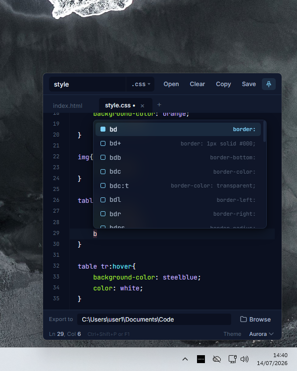
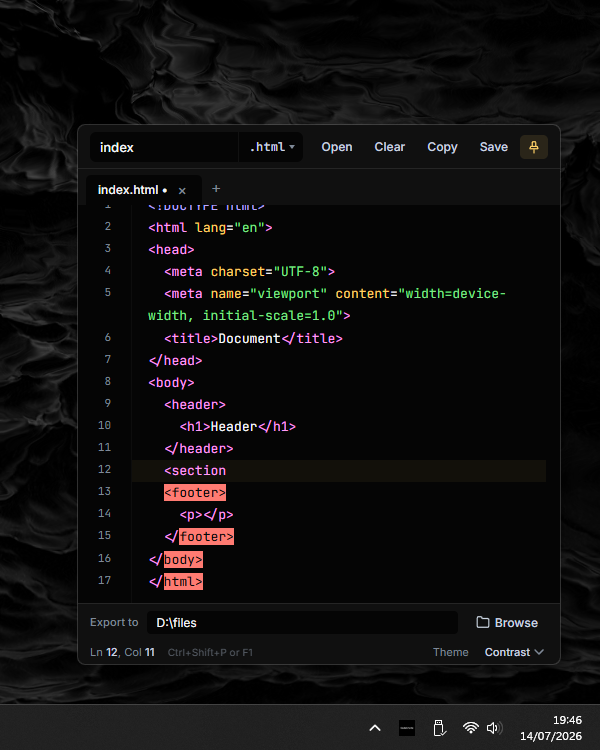
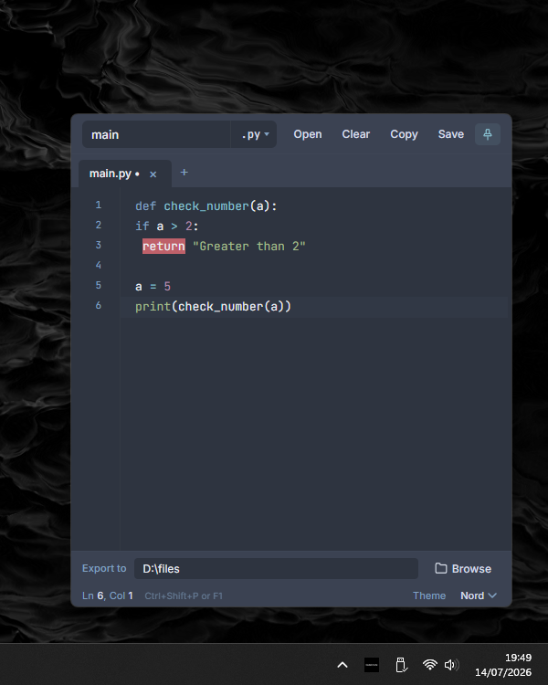
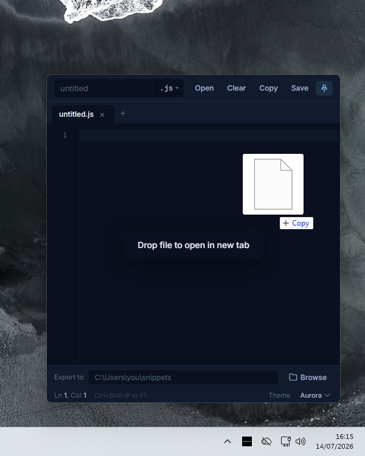
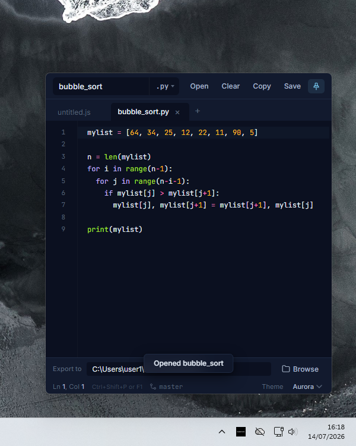
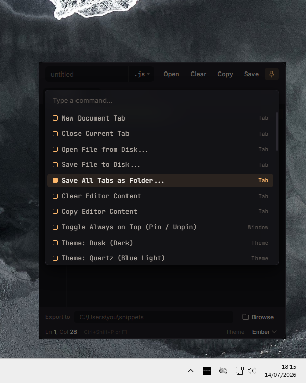
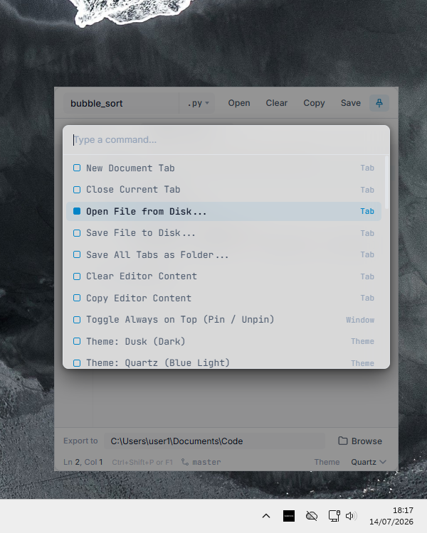

<p align="center">
  <picture>
    <source media="(prefers-color-scheme: dark)" srcset="assets/readme/text_dark_mode.svg">
    <source media="(prefers-color-scheme: light)" srcset="assets/readme/text_light_mode.svg">
    
  </picture>
</p>

>CodeCrate is a modern desktop app built for creating, editing, and exporting code snippets. Available from the system tray, it lets you capture ideas and share code without interrupting your workflow.

<br>

<p align="center">
  
  
</p>

## Download

| Platform | Version | Download |
|----------|----------|----------|
| Windows 11 | v2.2 | [CodeCrateWindows.zip](https://github.com/alanwnuczko/code-crate/releases/tag/v2.2) |
| Linux | v2.2 | [CodeCrateLinux.tar.xz](https://github.com/alanwnuczko/code-crate/releases/tag/v2.2) |

## System requirements

### Windows
- **OS**: Windows 10/11
- **Architecture**: x64
- **Python**: 3.10+

### Linux
- **OS**: Ubuntu 22.04+ / Debian 12+ (or any Debian-based distro)
- **Python**: 3.10+
- **Desktop**: GNOME, KDE, XFCE, or any DE with AppIndicator support

<p align="center">
  
</p>

---

## Inline Expansions & Boilerplates

- **Instant HTML5 Boilerplate**: Type `!` and press `Enter` to generate a complete, standard HTML document structure.
- **Smart Abbreviations**: Expand short abbreviations into complete code structures as you type.
- **Multi-Language Support**: Expansions are fully integrated and supported across **HTML**, **CSS**, and **JavaScript**.

<p align="center">
  
  
</p>

## Real-Time Error Highlighting

Catch mistakes before you export with visual syntax validation right inside the editor.

- **Visual Feedback**: Syntax errors and structural mistakes are immediately highlighted in red as you type, making them easy to spot.
- **HTML Tag Checking**: Automatically detects unclosed, mismatched, or broken tags, highlighting the specific elements affected by the structure break.
- **Language-Specific Rules**: Identifies strict formatting and syntax issues across supported languages, such as missing indentation in Python blocks.

<p align="center">
  
  
</p>

## Drag & Drop

Seamlessly open and work with existing code files by dragging them right from your file manager onto the editor.

- **Tab Creation**: Dropping any code file opens it in a new, dedicated editor tab with syntax highlighting applied based on its extension.
- **Native Path & Folder Tracking**: CodeCrate extracts the directory path, linking the file to the **`Export to`** bar at the bottom.
- **Git Repository Detection**: If your dropped file belongs to a Git repository, CodeCrate detects and displays the active **Git branch** (`e.g. main`) in the status bar.
- **Direct-to-Disk Saving (`Ctrl+S`)**: Because the native disk path is preserved, pressing `Ctrl+S` saves any edits back to your local file without prompting for a folder.

<p align="center">
  
  
</p>

## Command Palette

Access all of CodeCrate's core features without leaving your keyboard using the Command Palette.

- **Fast Workflow**: Press `Ctrl+Shift+P` or `F1` to open the palette. Start typing to instantly filter through available actions.
- **Batch Exporting & File Management**: Seamlessly open files, save individual documents, or use the **Save All Tabs as Folder** command to export your entire multi-tab workspace into a single directory.
- **Window & Theme Controls**: Toggle the app to stay "Always on Top" (pinned) so it doesn't get lost behind other windows, or switch between themes.

<p align="center">
  
  
</p>

## Git Branch Tracking

Always know your version control status with zero configuration.

- **Detection**: Checks if your active file belongs to a local Git repository.
- **Status Bar Indicator**: Displays your active Git branch (e.g., `main`) below the file path.

## Keyboard Shortcuts

<table>
  <thead>
    <tr>
      <th>Category</th>
      <th>Shortcut</th>
      <th>Action</th>
    </tr>
  </thead>
  <tbody>
    <tr>
      <td rowspan="5"><b>File & Tab Management</b></td>
      <td><code>Ctrl</code> + <code>T</code></td>
      <td>Open a new tab</td>
    </tr>
    <tr>
      <td><code>Ctrl</code> + <code>N</code></td>
      <td>Create a new file (opens prompt)</td>
    </tr>
    <tr>
      <td><code>Ctrl</code> + <code>O</code></td>
      <td>Open file from disk</td>
    </tr>
    <tr>
      <td><code>Ctrl</code> + <code>S</code></td>
      <td>Save current file directly to disk</td>
    </tr>
    <tr>
      <td><code>Ctrl</code> + <code>W</code></td>
      <td>Close active tab</td>
    </tr>
    <tr>
      <td rowspan="3"><b>Command Palette & Actions</b></td>
      <td><code>Ctrl</code> + <code>Shift</code> + <code>P</code></td>
      <td>Open Command Palette</td>
    </tr>
    <tr>
      <td><code>F1</code></td>
      <td>Open Command Palette</td>
    </tr>
    <tr>
      <td><code>Esc</code></td>
      <td>Close Command Palette or active modal</td>
    </tr>
    <tr>
      <td rowspan="5"><b>Editor & Code Editing</b></td>
      <td><code>!</code> + <code>Enter</code></td>
      <td>Generate full HTML5 boilerplate (<i>HTML and PHP mode only</i>)</td>
    </tr>
    <tr>
      <td><code>Tab</code></td>
      <td>Expand abbreviation snippet or Indent</td>
    </tr>
    <tr>
      <td><code>Ctrl</code> + <code>L</code></td>
      <td>Select current line (or extend selection down)</td>
    </tr>
    <tr>
      <td><code>Ctrl</code> + <code>Enter</code></td>
      <td>Insert new line below current line with auto-indent</td>
    </tr>
    <tr>
      <td><code>Shift</code> + <code>Alt</code> + <code>Down</code></td>
      <td>Duplicate current line downward</td>
    </tr>
    <tr>
      <td rowspan="4"><b>Zoom Controls</b></td>
      <td><code>Ctrl</code> + <code>=</code></td>
      <td>Zoom In</td>
    </tr>
    <tr>
      <td><code>Ctrl</code> + <code>-</code></td>
      <td>Zoom Out</td>
    </tr>
    <tr>
      <td><code>Ctrl</code> + <code>0</code></td>
      <td>Reset Zoom ( 13px )</td>
    </tr>
    <tr>
      <td><code>Ctrl</code> + <code>Mouse Wheel</code></td>
      <td>Zoom In / Out via scrolling</td>
    </tr>
  </tbody>
</table>

---

## Development & Building

### Running Locally

1. **Clone the repository:**
   ```bash
   git clone https://github.com/alanwnuczko/code-crate.git
   cd code-crate
   ```

2. **Set up a virtual environment & install dependencies:**
    ##### Windows:
    ```bash
    python -m venv .venv
    .\.venv\Scripts\activate
    pip install pywebview pystray pillow pywin32
    python Windows/main.py
    ```

    ##### Linux:
    ```bash
    sudo apt update
    sudo apt install -y python3-gi python3-gi-cairo gir1.2-gtk-3.0 gir1.2-webkit2-4.1 libgirepository-2.0-dev libgirepository1.0-dev gcc libcairo2-dev pkg-config python3-dev
    python3 -m venv .venv && source .venv/bin/activate
    pip install pywebview pystray pillow pygobject
    python Linux/main.py
    ```

### Building on Windows

**1. Install Python dependencies**
```bash
pip install pyinstaller pywebview pystray pillow pywin32
```

**2. Run PyInstaller**
```powershell
pyinstaller --noconfirm --onedir --windowed `
  --name "CodeCrate" `
  --icon "assets/tray.ico" `
  --add-data "Windows/index.html;Windows" `
  --add-data "assets;assets" `
  --add-data "css;css" `
  --add-data "js;js" `
  "Windows/main.py"
```

### Building on Linux

**1. Install Linux Dependencies**
```bash
sudo apt update
sudo apt install -y python3-gi python3-gi-cairo gir1.2-gtk-3.0 gir1.2-webkit2-4.1 libgirepository-2.0-dev libgirepository1.0-dev gcc libcairo2-dev pkg-config python3-dev
```

**2. Install Python dependencies**
```bash
pip install pyinstaller pywebview pystray pillow pygobject
```

**3. Run PyInstaller**
```bash
pyinstaller --noconfirm --onedir \
  --name "CodeCrate" \
  --icon "assets/tray.ico" \
  --add-data "Linux/index.html:Linux" \
  --add-data "assets:assets" \
  --add-data "css:css" \
  --add-data "js:js" \
  --collect-all gi \
  --collect-all webview \
  --collect-all pystray \
  --hidden-import gi.repository.Gtk \
  --hidden-import gi.repository.Gdk \
  --hidden-import gi.repository.WebKit2 \
  --hidden-import gi.repository.GLib \
  --hidden-import pystray._gtk \
  "Linux/main.py"
```
