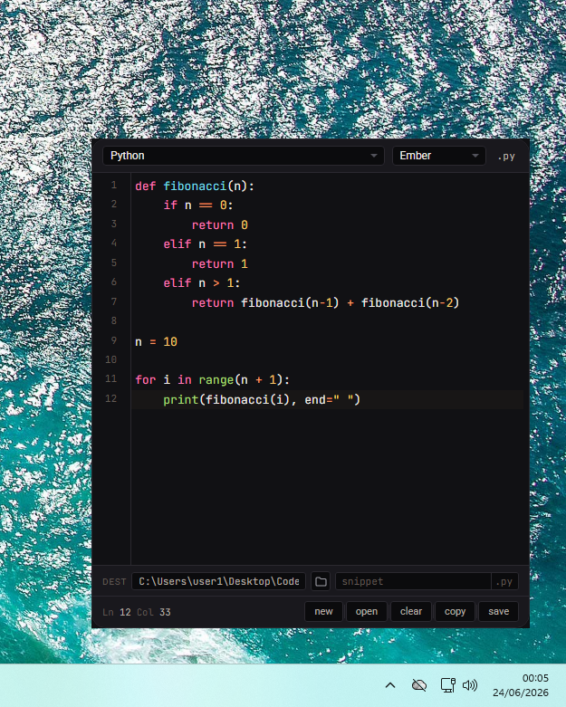
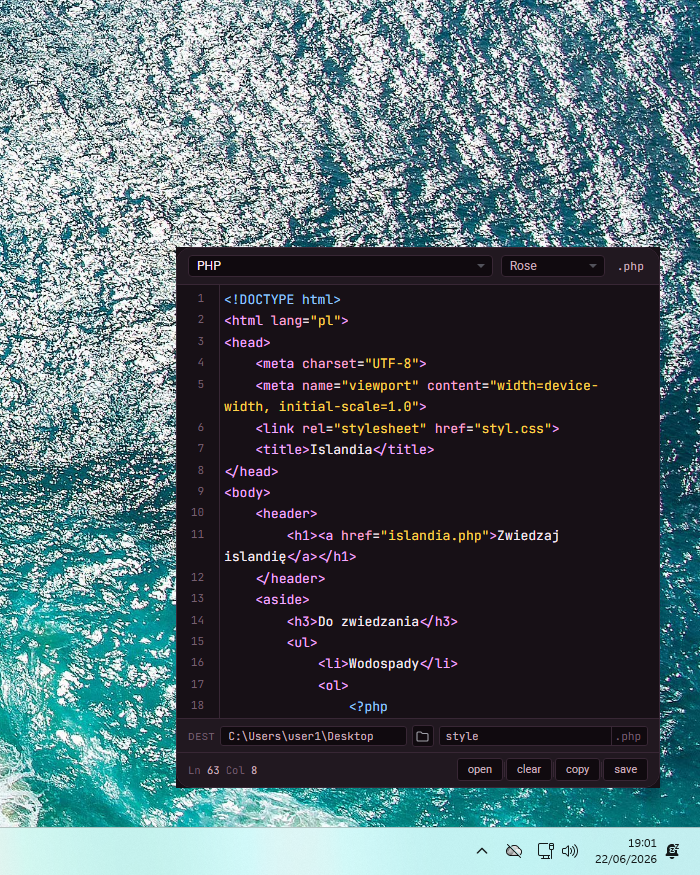

# CodeCrate

## Download

| Platform | Version | Download |
|----------|----------|----------|
| Windows 11 | v1.0 | [Download](https://github.com/alanwnuczko/code-crate/releases/tag/v1.0) |

## Dependencies
```bash
pip install pywebview pillow pystray
```

---

<p align="center">
  
  
  
  
</p>
