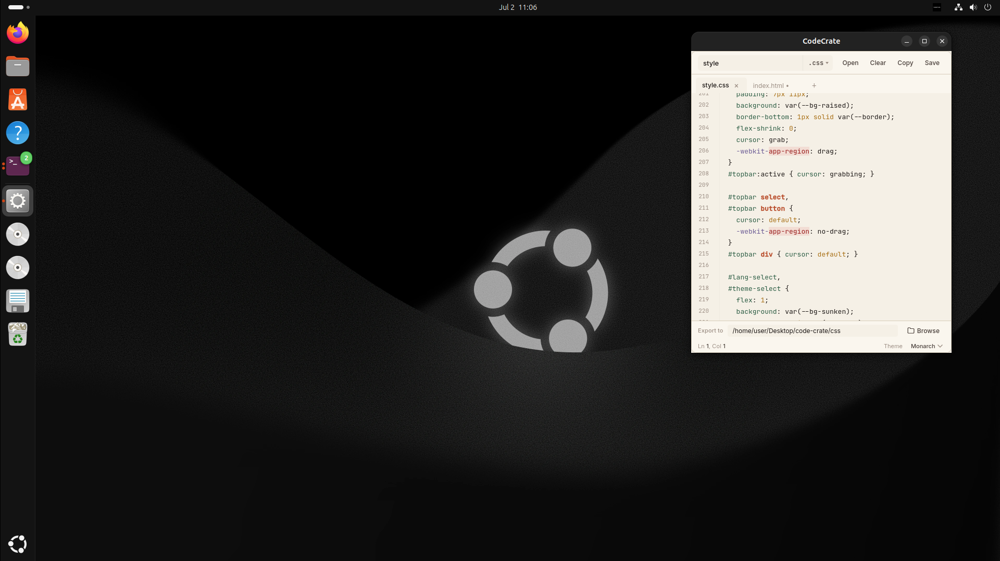
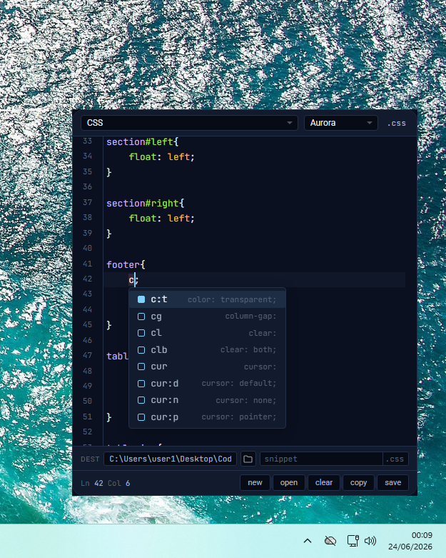
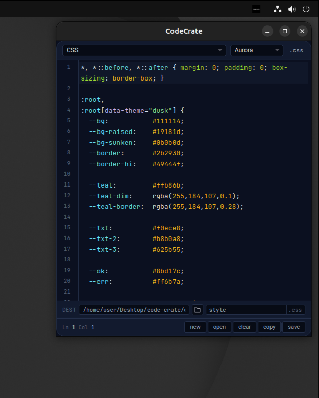
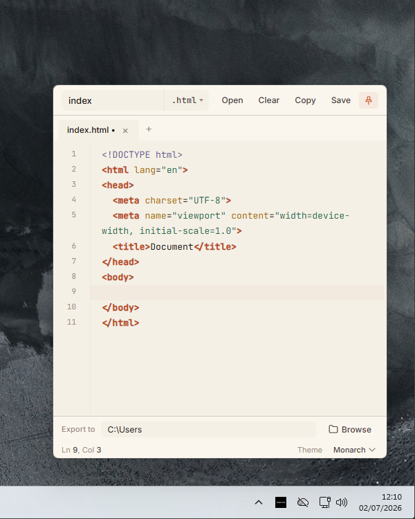
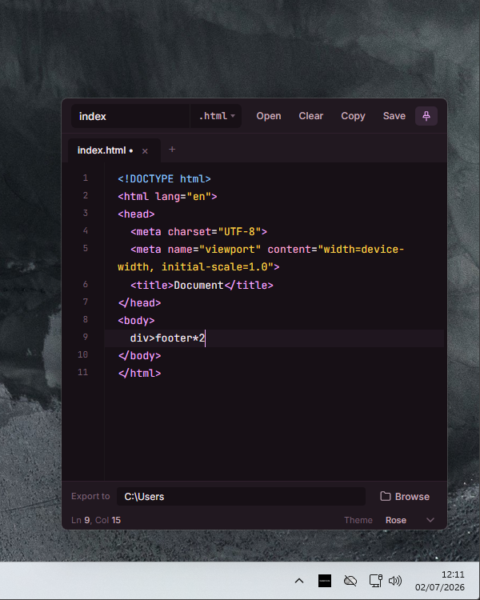
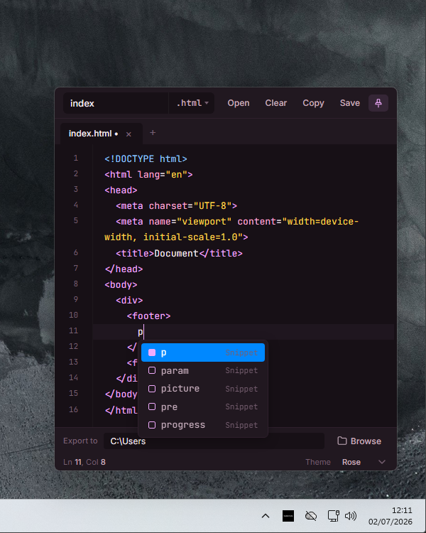

<p align="center">
  <picture>
    <source media="(prefers-color-scheme: dark)" srcset="assets/readme/text_dark_mode.svg">
    <source media="(prefers-color-scheme: light)" srcset="assets/readme/text_light_mode.svg">
    
  </picture>
</p>

<p align="center">
  
</p>
<p align="center">
  
  
</p>

## In-editor hints

Speed up development with inline code expansions.

Supported languages:
- HTML
- CSS
- JavaScript

### HTML boilerplate

Type `!` and press Enter to instantly generate a full HTML boilerplate.

<p align="center">
  
</p>

### Inline expansions

Expand abbreviations into complete code structures as you type.

<p align="center">
  
  
</p>

## System requirements
### Windows
- **OS**: Windows 10/11
- **Architecture**: x64
- **Python**: 3.10+

### Linux
- **OS**: Ubuntu 22.04+ / Debian 12+ (or any Debian-based distro)
- **Python**: 3.10+
- **Desktop**: GNOME, KDE, XFCE, or any DE with AppIndicator support

## Download

| Platform | Version | Download |
|----------|----------|----------|
| Windows 11 | v2.1 | [CodeCrateWindows.zip](https://github.com/alanwnuczko/code-crate/releases/tag/v2.2) |
| Linux | v2.1 | [CodeCrateLinux.tar.xz](https://github.com/alanwnuczko/code-crate/releases/tag/v2.2) |

---

## Build Guide

### Building on Windows

##### Python Dependencies
```bash
pip install pyinstaller pywebview pystray pillow pywin32
```

##### Run PyInstaller
Execute the following command from the project root:

```powershell
pyinstaller --noconfirm --onedir --windowed `
  --name "CodeCrate" `
  --icon "assets/tray.ico" `
  --add-data "Windows/index.html;Windows" `
  --add-data "assets;assets" `
  --add-data "css;css" `
  --add-data "js;js" `
  "Windows/main.py"
```

### Building on Linux

##### Linux Dependencies
```bash
# Ubuntu/Debian system dependencies
sudo apt update
sudo apt install -y python3-gi python3-gi-cairo gir1.2-gtk-3.0 gir1.2-webkit2-4.1 libgirepository1.0-dev gcc libcairo2-dev pkg-config python3-dev

# Python dependencies
pip install pyinstaller pywebview pystray pillow pygobject
```

##### Run PyInstaller
Execute the following command from the project root:

```bash
pyinstaller --noconfirm --onedir --windowed \
  --name "CodeCrate" \
  --icon "assets/tray.ico" \
  --add-data "Linux/index.html:Linux" \
  --add-data "assets:assets" \
  --add-data "css:css" \
  --add-data "js:js" \
  "Linux/main.py"
```
